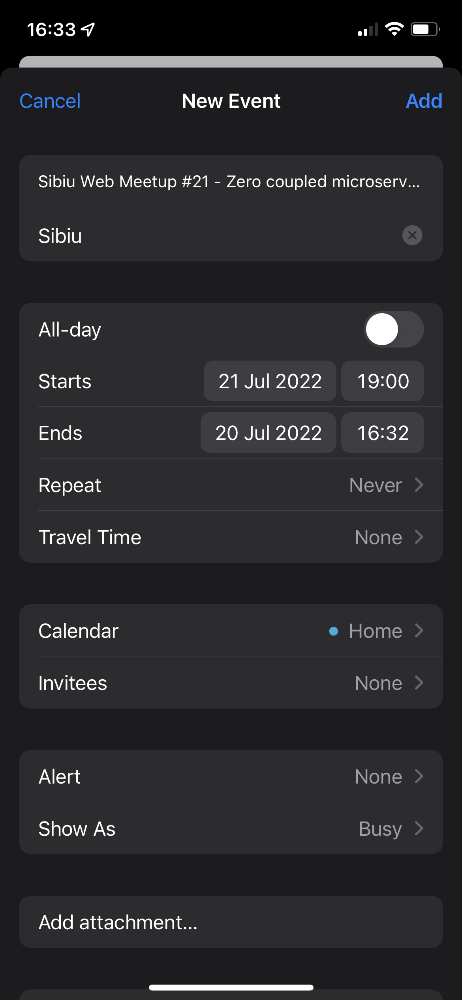

# [BUG-001]: Wrong End Date when adding an event to the calendar

### Refers to: [TC-003](../test-cases/TC-003.md)

### Discovered on: 
- [TE-003](../test-execution/TE-003.md)

### Applies to:
- iPhone 12, with iOS 15.5 (19F77)

### Severity: Medium

### Steps to reproduce

On the iOS device, clicking on the event date will open the Calendar application. Notice that the end date is wrong.

### Expected result

The end date should be in the future. If there is no end date on the DB, then the end date should default to 1 hour from the starting date.

### Screenshots

