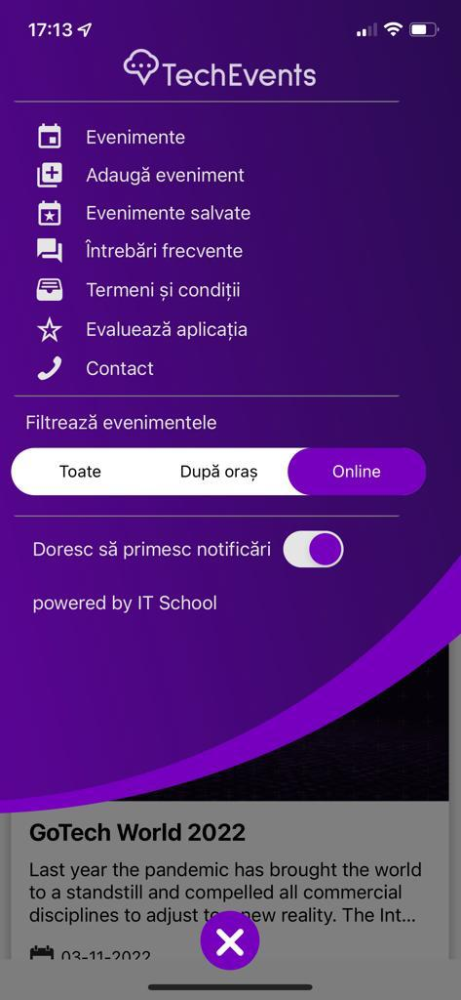

# [BUG-002]: After filtering from the main menu, the application doesn't display the filtered results

### Refers to: [TC-005](../test-cases/TC-005.md)

### Discovered on: 
- [TE-005](../test-execution/TE-005.md)

### Applies to:
- iPhone 12, with iOS 15.5 (19F77)
- Samsung Galaxy S22 Ultra, with Android 12

### Severity: High

### Steps to reproduce

On the selected device, try to filter the events from the main menu by any of the options. Notice that, upon selecting an option, the application is not returning to the main screen and doesn't show the filtered results.

### Expected result

The application should close the main menu and display the filtered results on the main screen.

### Screenshots

