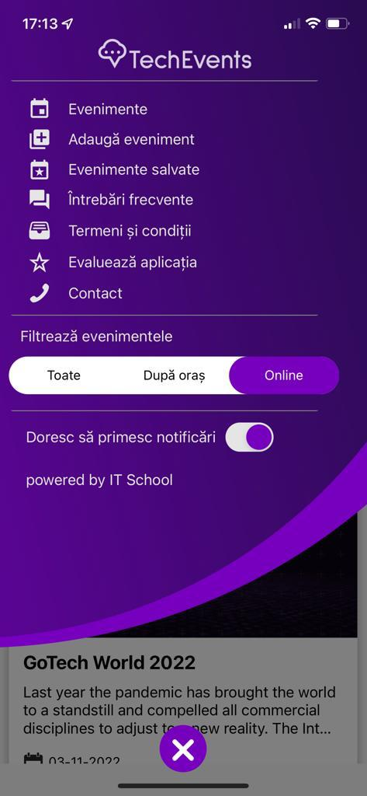

# [BUG-003]: No Link Present on the powered by text

### Refers to: [TC-005](../test-cases/TC-005.md)

### Discovered on: 
- [TE-005](../test-execution/TE-005.md)

### Applies to:
- iPhone 12, with iOS 15.5 (19F77)
- Samsung Galaxy S22 Ultra, with Android 12

### Severity: Low

### Steps to reproduce

On the selected device, on the main menu, notice that "Powered by IT School" has no link associated with it.

### Expected result

The "Powered by IT School" text should have a link leading to the IT School webpage

### Screenshots

