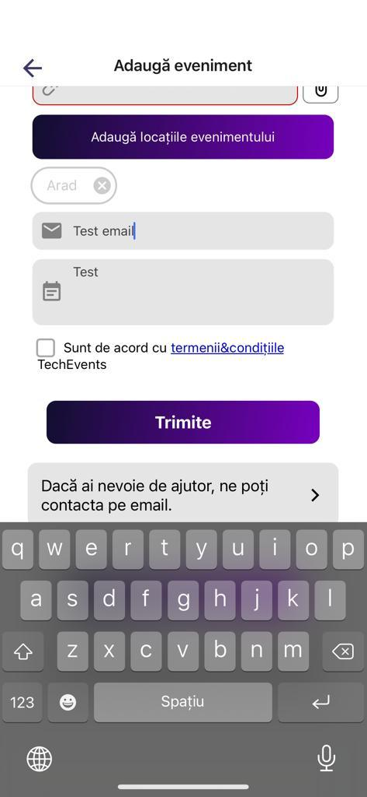

# [BUG-006]: The user can input an invalid email on the add event form

### Refers to: [TC-006](../test-cases/TC-006.md)

### Discovered on: 
- [TE-006](../test-execution/TE-006.md)

### Applies to:
- iPhone 12, with iOS 15.5 (19F77)
- Samsung Galaxy S22 Ultra, with Android 12

### Severity: Medium

### Steps to reproduce

On the add event form, on the email field, the user can add a wrong URL (e.g. "test")

### Expected result

The email validation should be performed and an error should be presented if the email is malformed.

### Screenshots

