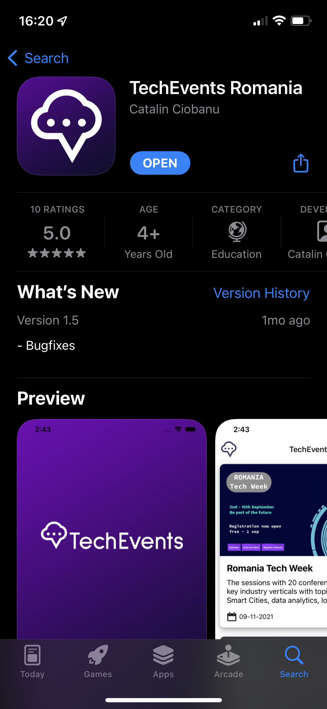

# [TC-011]: Application installation from Apple App Store

## Test status: ✅ PASS

## Device used: iPhone 12

## Test Execution

| #  | Step description                                 | Expected result                                        | Result |
|----|--------------------------------------------------|--------------------------------------------------------|:------:|
| 1. | Open App Store on the iPhone device              | App Store is loaded                                    | ✅  |
| 2. | Search for the Tech Events app                   | The app is found and listed                            | ✅  |
| 3. | Click the install button                         | Installing completes and the open button is displayed  | ✅  |
| 4. | Click the open button                            | The app opens and it is ready to use                   | ✅  |

## Bugs Found

N/A

## Test Evidence Screenshots

## Legend

✅ - PASS\
⭕ - FAIL

