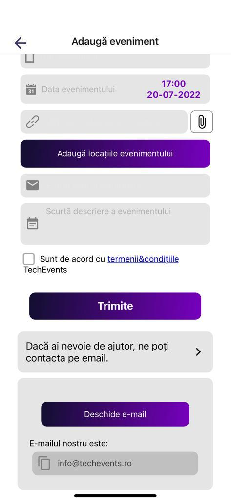

# [TC-006]: The Add Event screen

## Test status: ⭕ FAIL

## Device used: iPhone 12

## Test Execution

| #  | Step description                     | Expected result                                                                               | Result |
|----|--------------------------------------|-----------------------------------------------------------------------------------------------|:------:|
| 1.  | Open the TechEvents app                                                | Application opens without errors or crashes, and the main screen is loaded. | ✅  |
| 2.  | On the main screen, tap on the main menu and select "Adauga Eveniment" | The main menu is displayed, tapping the "Adauga Eveniment" option will open the Add Event Screen | ✅  |
| 3.  | Add Event screen notification is visible                               | Adding an event from the application is discouraged, and the user is provided with an accurate message. Tapping on the button will provide the user with the add event form. | ✅  |
| 4.  | Visually inspect the Add Event form                                    | All fields are present and editable. The system recognizes the inputs and the user can edit/input information into them.  | ✅  |
| 5.  | Validation of the title input                                          | Try to submit the form with an empty title input. The user is presented with an error message, the form is not sent, and the title input border is coloring in red. | ✅  |
| 6.  | Validation of the URL input                                            | Try to submit the form with an empty URL input. The user is presented with an error message, the form is not sent, and the URL input border is coloring red. | ✅  |
| 7.  | Validation of the URL input #2                                         | Try to submit the form with the wrong formatted URL input. The user is presented with an error message, the form is not sent, and the URL input border is coloring red. | ⭕  |
| 8.  | Validation of the event date                                           | Try to submit the form with an event date. The user is presented with an error message, the form is not sent, and the date input is coloring red. | ⭕  |
| 9.  | Validation of the locations input                                      | Try to submit the form with no location set. The user is presented with an error message, the form is not sent, and the location textarea is coloring red. | ✅  |
| 10. | Validation of the email input                                          | Try to submit the form with no email or with a wrong formatted email. The user is presented with an error message, the form is not sent, and the email field is coloring red. | ⭕  |
| 11.  | Validation of the description input                                   | Try to submit the form with an empty description input. The user is presented with an error message, the form is not sent, and the description input border is coloring in red. | ✅  |
| 12.  | Validation of terms checkbox                                          | Try to submit the form without checking the terms and conditions checkbox. The user is presented with an error message, and the form is not sent. | ✅  |
| 13.  | Sending form event                                                    | Try to submit the form with all the fields correctly filled. The user is presented with a success message, and the form is sent. | ⭕  |
| 14.  | Help needed button visual inspect                                     | Tap on the Help needed button. A new section is opened. Check if the email field is present and it has the value: info@techevents.ro. | ✅  |
| 15.  | Help needed button action                                             | Tap on the "Deschide e-mail" button. The default device mailbox is opened, the subject is prefilled with "Adaugare eveniment" and the "to" field is prefilled with "info@techevents.ro" email address | ✅  |

## Bugs Found

- [BUG-004 - The user can input an invalid URL on the add event form](../bug-reports/BUG-004.md)
- [BUG-005 - Various issues with the date field from the add event form](../bug-reports/BUG-005.md)
- [BUG-006 - The user can input an invalid email on the add event form](../bug-reports/BUG-006.md)
- [BUG-007 - Add event form is not submitted](../bug-reports/BUG-007.md)
- [BUG-008 - Add event form inputs are misaligned](../bug-reports/BUG-008.md)
- [BUG-009 - Add an event screen has a huge white space at the bottom of the screen](../bug-reports/BUG-009.md)

## Test Evidence Screenshots

## Legend

✅ - PASS\
⭕ - FAIL

