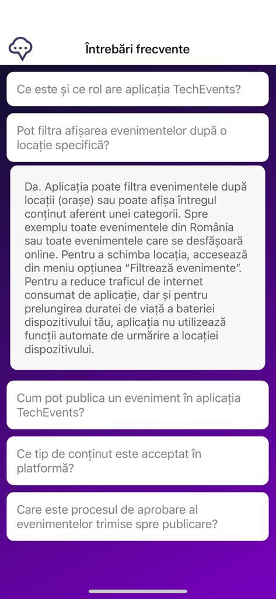

# [TC-008]: The FAQ screen

## Test status: ✅ PASS

## Device used: iPhone 12

## Test Execution

| #  | Step description                     | Expected result                                                                               | Result |
|----|--------------------------------------|-----------------------------------------------------------------------------------------------|:------:|
| 1.  | Open the TechEvents app                                                   | Application opens without errors or crashes, and the main screen is loaded. | ✅  |
| 2.  | On the main screen, tap on the main menu and select "Intrebari frecvente" | The main menu is displayed, and tapping the "Intrebari frecvente" option will open the FAQ Screen | ✅  |
| 3.  | Visually inspect the screen                                               | There are no open answers, all FAQ items are listed in an accordion style list | ✅  |
| 4.  | Toggle answer for any question                                            | Tapping on a question will toggle the answer for it, tapping again will close the answer. There should not be two questions opened at the same time.| ✅  |

## Bugs Found

N/A

## Test Evidence Screenshots

## Legend

✅ - PASS\
⭕ - FAIL

