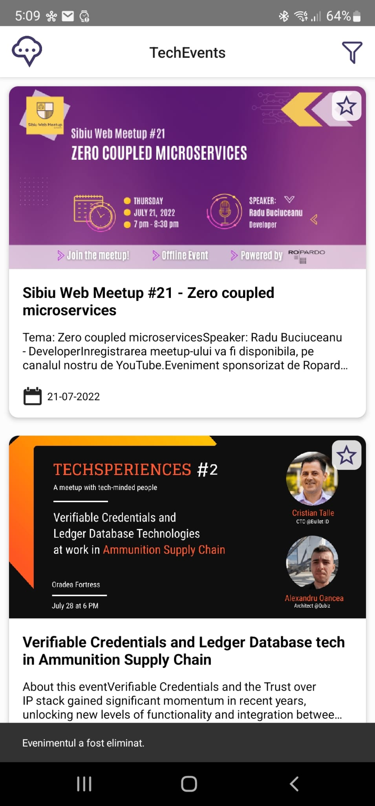

# [TC-002]: Application main screen

## Test status: ✅ PASS

## Device used: Samsung Galaxy S22 Ultra

## Test Execution

| #  | Step description                     | Expected result                                                                               | Result |
|----|--------------------------------------|-----------------------------------------------------------------------------------------------|:------:|
| 1. | Open TechEvents app                  | Application opens without errors or crashes, and the main screen is loaded.                   | ✅  |
| 2. | Visually inspect the app main screen | The design is consistent, the events are visible, and there are no broken images              | ✅  |
| 3. | Click on the left menu icon          | The menu is opening and shows the correct information, the menu can be closed                 | ✅  |
| 4. | Click on the filtering icon          | The filtering menu opens, the information is correct, user can go back to the main app screen | ✅  |

## Bugs Found

N/A

## Test Evidence Screenshots

## Legend

✅ - PASS\
⭕ - FAIL

