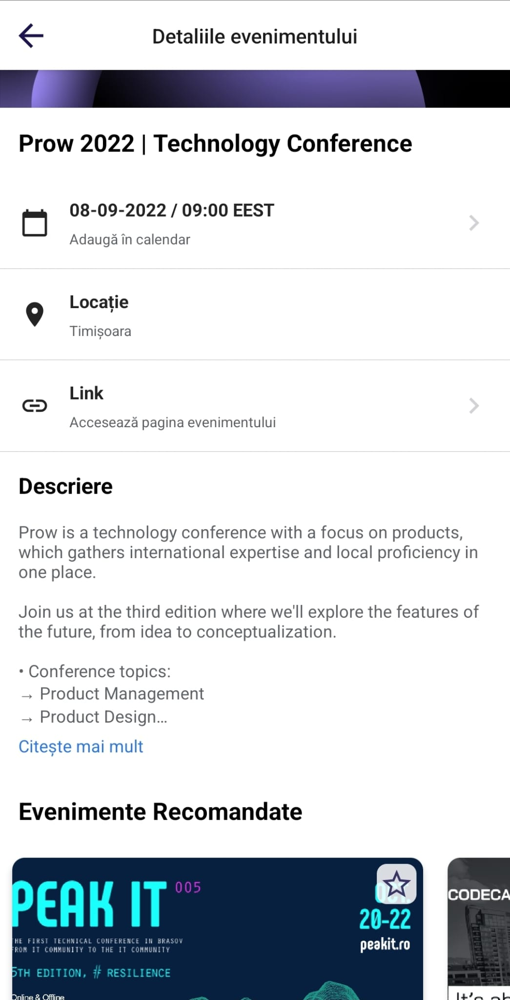

# [TC-003]: Application events interaction

## Test status: ✅ PASS

## Device used: Samsung Galaxy S22 Ultra

## Test Execution

| #  | Step description                     | Expected result                                                                               | Result |
|----|--------------------------------------|-----------------------------------------------------------------------------------------------|:------:|
| 1. | Open TechEvents app                         | Application opens without errors or crashes, and the main screen is loaded. | ✅  |
| 2. | On the main screen, tap on any event listed | The event screen is presented | ✅  |
| 3. | Visually inspect the event screen           | The following information is present: the poster image, the date and time, the location, the link to the official web page, the description, and the recommended events | ✅  |
| 4. | Add event to favorite                       | Tap on the favorite icon, the icon turns solid and a message that the event was added to the favorites list is presented to the user. Going back to the main screen, the event is highlighted as a favorite. | ✅  |
| 5. | Tap on the event poster image               | The image opens as a popup, the user can close the popup and return to the main event screen | ✅  |
| 6. | Tap on the event date                       | An Android system calendar will appear. The calendar should have the correct date, time, event location, and event name, the user can add the event to his calendar. |✅  |
| 7. | Tap on the event link                       | The link is not broken, the event webpage is presented to the user using the favorite browser set on the mobile phone. | ✅  |
| 8. | Check the event description                 | The event has the correct description, there are no typos, tapping on the "Citeste mai mult" button will open the full event description. | ✅  |
| 9. | Check the recommended events section        | There is a recommended events section, the user can swipe to see all the recommended events, and the user can tap on an event and see the event page. | ✅  |
| 10. | Check the back button functionality        | Tapping on the back button should return the user to the previously visited screen. | ✅  |

## Bugs Found

N/A

## Test Evidence Screenshots

## Legend

✅ - PASS\
⭕ - FAIL

